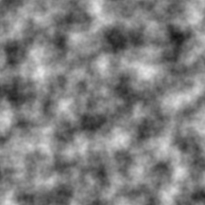
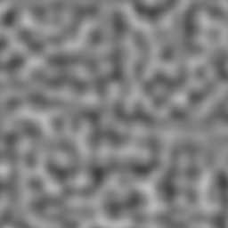
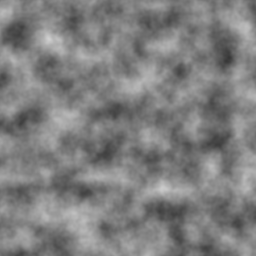

# Pure C noise

**is a program that implements perlin noise 2d and 3d replicating the functions of the glsl language
all in pure C++**

## characteristics

### perlin noise 2D
### Perlin Noise 3D (with slice in z)
### FBM

## Result

*Perlin Noise 2D*


*FBM 2D (OCTAVES = 4)*



*Perlin Noise 3D*



*FBM 3D (OCTAVES = 4)*



## Config

### in (src/program/core/config.hpp)

```c++
constexpr float SCALE = 0.03f; 
constexpr float octaves = 4.0;
constexpr float zslice = 10.0; /* for the z coordinate */
```
